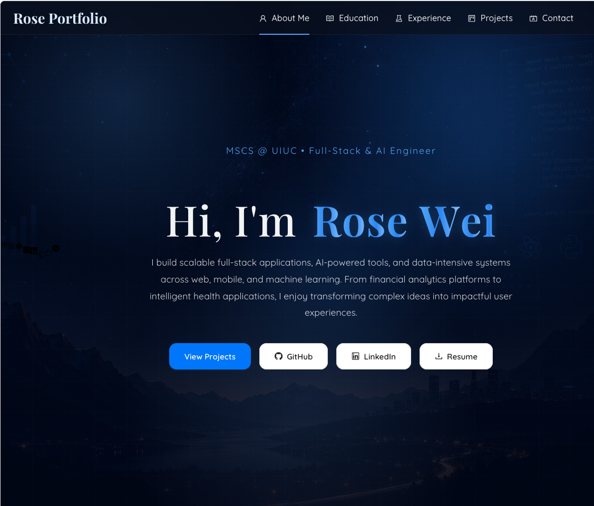

# 🌸 Rose Portfolio

A modern and responsive personal portfolio website built with React, TypeScript, and Ant Design to showcase my projects, experience, and technical skills.

## ✨ Features

- Responsive modern UI
- Smooth scrolling navigation
- Animated landing and about sections
- Interactive project showcase
- Mobile-friendly navigation drawer
- Resume download support
- Clean gradient-based design system

## 🛠️ Tech Stack

### Frontend
- React
- TypeScript
- Ant Design
- CSS3

### Tools & Libraries
- Vite
- React Hooks
- Ant Design Icons

---

## 📂 Project Structure

```bash
src/
├── components/
│   ├── AboutMe.tsx
│   ├── Contact.tsx
│   ├── Experience.tsx
│   ├── Footer.tsx
│   ├── Landing.tsx
│   ├── Projects.tsx
│   └── Resume.tsx
│
├── styles/
│   ├── aboutme.css
│   ├── projects.css
│   └── ...
│
├── App.tsx
└── App.css
```

---

## 🚀 Featured Projects

### Academic World Dashboard
A full-stack analytics dashboard for exploring academic publications and university research performance.

**Tech Used:**  
Python, Dash, Plotly, MySQL, MongoDB, Neo4j

### Anniversary Report Tool
An automated employee milestone tracking and notification system developed during the GeoEngineers Corporate Alliance Program.

**Tech Used:**  
React, PostgreSQL, Node.js

### The Wizard's Apprentice
A 3D platformer combat game developed in Unity with progressive abilities and level systems.

**Tech Used:**  
C#, Unity, 3D Modeling

---

## 📸 Screenshots

> Add screenshots of your landing page, projects section, and about section here.

```md

```

---

## ⚙️ Installation

Clone the repository:

```bash
git clone https://github.com/yourusername/portfolio.git
```

Navigate into the project folder:

```bash
cd portfolio
```

Install dependencies:

```bash
npm install
```

Start the development server:

```bash
npm run dev
```

---

## 🌐 Deployment

This project can be deployed using:

- Vercel
- Netlify
- GitHub Pages

---

## 📄 Resume

My resume is available directly from the portfolio website through the resume download button.

---

## 📫 Contact

Feel free to connect with me:

- LinkedIn: https://linkedin.com/in/your-link
- GitHub: https://github.com/yourusername
- Email: your.email@example.com

---

## 📌 Future Improvements

- Add dark/light mode toggle
- Add project filtering system
- Improve animations and transitions
- Add blog section
- Add backend contact form integration

---

## 🪪 License

This project is open-source and available under the MIT License.